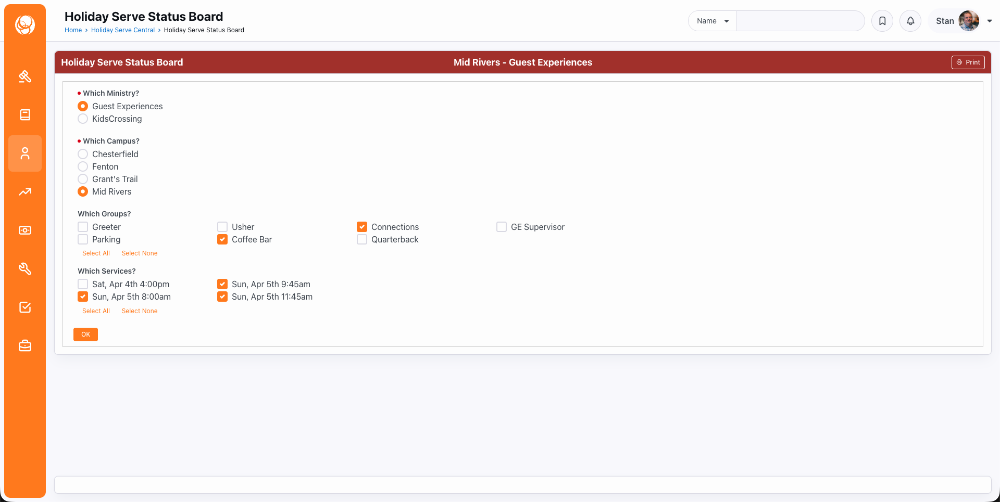
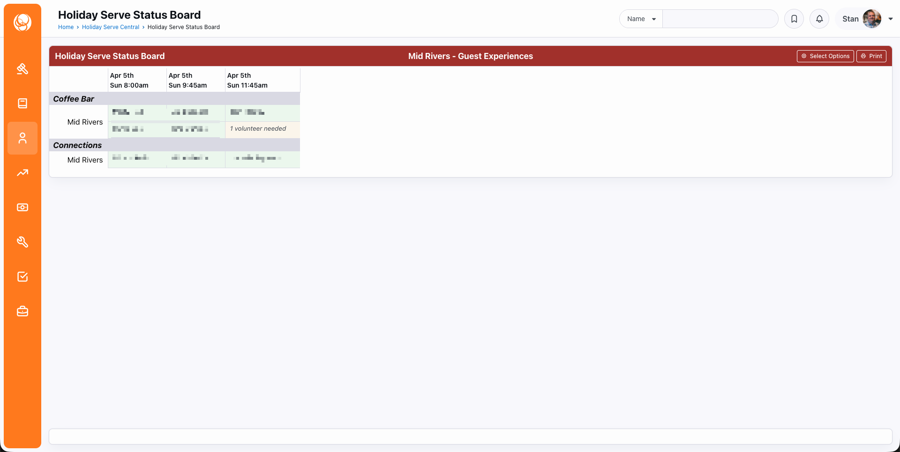

# Holiday Serve Signup

A custom volunteer campaign management app for [Rock RMS](https://www.rockrms.com), built with Helix (Lava Applications), Groups, and Group Scheduling.

Built by Stan Yoder & Karen Rossi at [The Crossing](https://thecrossing.church) – St. Louis, MO. Presented at RX2026.

---

## The Problem

The holidays are your busiest volunteer season. You need a lot of people, in specific roles, at specific times, across multiple campuses, for a short window. It's not a small group. It's not a standing serve team. It's a one-off campaign — and Rock's out-of-the-box tools don't quite fit.

We had been using a third-party plugin to fill that gap. It worked — until it didn't. The plugin was no longer maintained, required Rock admin access to manage (meaning ministry teams couldn't own their own signups), and gave us almost no control over the public-facing experience.

When it came time to replace it, we asked: *what can Rock already do?* The answer turned out to be almost everything we needed. We just had to combine the right pieces.

---

## The Solution

A Helix (Lava Applications) app that uses Rock's Groups and Group Scheduling as its data backbone. Ministry teams manage their own signups without needing Rock admin access. Volunteers get a clean, branded signup experience we control completely. And we get real-time visibility into where we stand across every campus and service.

The app has three parts:

- **Public signup** — volunteers choose their role, campus location, and service time(s) via a clean, branded page
- **Staff admin** — ministry teams manage their groups and volunteers without needing Rock admin access
- **Status board** — a real-time, printable view of volunteer coverage across all roles and service times

Everything is driven by standard Rock features: Group Scheduling for slot capacity, Attendance Occurrences for tracking signups, and Group Member attributes for a few extra fields.

One feature we're particularly proud of: ministry teams can share a single signup URL with their entire team — existing volunteers and new folks alike. Roles that require experience are restricted to members of a specific group, so those cards only appear for eligible volunteers. New volunteers see the open roles. One link, one set of instructions, no confusion.

---

## What It Looks Like

**Public signup** — volunteers land on a branded page, pick their campus, choose a serving role, and select which service time(s) they want. No Rock login required (though logged-in users can also sign up a family member).


**Staff admin** — ministry leads manage their own groups without needing Rock admin access. They can see who has signed up for each service, edit slot counts, and add or remove volunteers individually.


**Status board** — a real-time, printable view of coverage across all selected roles and services. Staff use this before and during the event to see at a glance where they're short.






---

## What's in This Repo

```
/lava-application/endpoints/         — 12 Helix endpoint files
/lava-application/content-blocks/    — 3 Lava Application Content block files
/lava-application/                   — Configuration Rigging JSON template (application-rigging.lava)
/styles/                             — CSS blocks for each page + print stylesheet
/scripts/                            — JS blocks for the admin and status board pages
/shortcodes/                         — Custom shortcodes used by the app
/screenshots/                        — Screenshots and GIFs used in this README
holidayserve-introparagraph.lava     — Example intro/login block for the public page (customize before use)
holiday-serve-signup-workflow.json   — Rock workflow export (import via Admin Tools > Power Tools)
SETUP.md                             — Full setup guide
```

---

## Prerequisites

- **Rock RMS v18 or later** — required for Helix (became a core feature in v18) and Tabler Icons (`ti ti-*` classes, which replaced Font Awesome in the RockNextGen theme)
- **Group Scheduling** enabled on your Group Type
- The custom shortcodes in `/shortcodes/` installed in your Rock environment:
  - `dropdownxing`, `radiobuttonlistxing`, `checkboxlistxing` — form controls with `name` attributes wired for HTMX (The Crossing's customized versions of Rock's built-in shortcodes)
  - `handlehelixresponseerror` — HTMX error handler, place at the end of each page block
  - `bkgdcheckstatus` — background check status shortcode (**example/reference only** — Crossing-specific, replace with your own implementation)

---

## Setup

Full setup instructions, data model explanation, configuration guide, and technical walkthrough are in **[SETUP.md](SETUP.md)**.

The short version:
1. Create your Ministry Team Defined Type and Group Type
2. Create your serving groups with locations and schedules
3. Set up the signup workflow (import from `holiday-serve-signup-workflow.json`)
4. Create the Helix application and add endpoints
5. Configure the Configuration Rigging JSON
6. Set up three Rock pages with the Lava Application Content blocks and HTML Content blocks for styles/scripts

---

## Customization

- **Brand color** — change `--secondary-color-lifeblood: #a1302b` in all four files in the `styles/` folder to match your brand
- **Holiday campaigns** — rename URL paths and update the holiday switch logic in `lava-application-blocks/HolidaySignup.lava` to support your campaigns
- **Ministry teams** — add or remove Defined Values in your Ministry Team Defined Type; the app pulls from this list dynamically
- **Background check column** — remove or replace the `bkgdcheckstatus` shortcode references if your ministry doesn't need this

---

## License

MIT — use, adapt, and share freely. If you build something from this, we'd love to hear about it in the [Rock Community](https://community.rockrms.com).

---

## Questions?

Drop a comment on the [Rock Community post](https://community.rockrms.com/recipes), open an issue in this repo, or find us on RocketChat — we're **@stan.yoder** and **@karenrossi**.
