# Holiday Serve Signup — Setup Guide

*Built by Stan Yoder & Karen Rossi, The Crossing – Chesterfield, MO. Presented at RX2026.*

---

## Before You Start

### Rock features required

- **Rock v18 or later** — required for both Helix (introduced as a core feature in v18) and Tabler Icons (which replaced Font Awesome in v18's RockNextGen theme). The icon classes throughout this solution use the `ti ti-*` prefix and will not render correctly on earlier versions.
- **Helix (Lava Applications)** — this entire solution lives in a Helix app. If you're not familiar with Helix, we'd suggest getting comfortable with the basics first: [Helix Documentation](https://community.rockrms.com/developer/helix)
- **Group Scheduling** — must be enabled on your Group Type
- A **signup workflow** to handle the actual scheduling action (more on this below)

### Custom shortcodes required

Our code uses several custom shortcodes we built for our environment. You'll need equivalent versions of these for the code to work as written:

- `dropdownxing` — Rock's built-in `dropdown` shortcode with one critical addition: a `name` attribute on the `<select>` element. Without `name`, HTMX cannot include the field's value in its requests, which breaks `Form.*` input handling in Helix endpoints.
- `radiobuttonlistxing` — Rock's built-in `radiobuttonlist` shortcode with a `name` attribute added to the radio inputs, for the same reason.
- `checkboxlistxing` — Rock's built-in `checkboxlist` shortcode with a `name` attribute on checkbox inputs, plus two additional item-level parameters: `addltext` (secondary label text) and `active` (set to `false` to render a checkbox as disabled/greyed out without removing it from the list).
- `handlehelixresponseerror` — listens for HTMX `responseError` events and displays a dismissing alert in the appropriate target element. Place it at the end of each Lava Application Content block.
- `bkgdcheckstatus` — returns a JSON object with icon class, color, opacity, and status description for a person's background check. **Crossing-specific** — provided as a reference implementation only. You will need to write your own version based on your background check provider and Rock attribute setup.

All of these shortcodes are available in the `/shortcodes/` folder of this repo. If you prefer to use Rock's built-in shortcodes instead of the xing variants, the key requirement is that your form inputs render a `name` attribute — without it, Helix's `Form.*` input handling will not be able to read the submitted values.

---

## How the Data Is Modeled

Before touching Helix, you need to understand how the data is structured — because getting this right is what makes everything else work.

### One Group = One Serving Role at One Campus

Each group in our custom Group Type represents a single serving role (e.g., "Parking & Shuttle") at a single campus. If you have four campuses and six roles, that's up to 24 groups — one per role/campus combination.

Groups are scoped to a campus using Rock's built-in `CampusId` on the Group record.

### Group Locations = Where Volunteers Serve

Each group has one or more Group Locations. A location represents a physical serving station within that campus for that role. For most roles this is a single location; for others (like Parking) it might be multiple.

### Schedules = The Service Times

Each Group Location is linked to one or more Schedules via Group Location Schedules. These Schedules represent the specific service times for the holiday campaign — e.g., "Christmas Eve 3pm," "Christmas Eve 5pm," "Christmas Day 10am."

> **Important:** These schedules need an `EffectiveStartDate` set to the actual date of the service. The code uses `EffectiveStartDate >= GETDATE()` to filter out past services automatically.

> **Single-occurrence schedules only.** The code never reads a schedule's `iCalendarContent`, so it has no way to expand recurring schedule patterns. Each service time must be its own single-occurrence schedule (e.g., "Christmas Eve 3pm" as a standalone entry). Recurring schedules will appear but their occurrences will not be correctly handled.

> **Tip:** Create a dedicated Schedule Category for your holiday campaign schedules (e.g., "Service Times - Holiday") and keep them separate from your regular weekend schedules. It makes them much easier to find, manage, and clean up after the campaign is over.

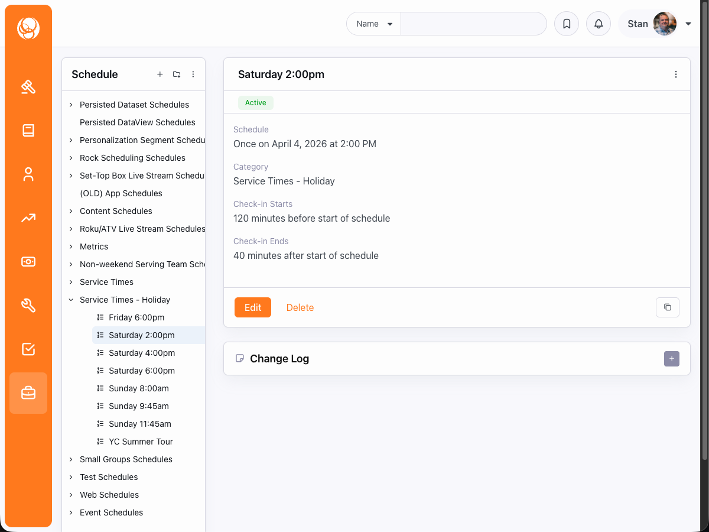

### Desired Capacity = How Many Slots

For each Group Location + Schedule combination, a `GroupLocationScheduleConfig` record holds the `DesiredCapacity` — the number of volunteer slots available. This is what you're managing when you "edit total slots" in the admin.

> **Note:** Rock's Group Scheduling also supports `MinimumCapacity` and `MaximumCapacity` on the same record, but this solution only reads `DesiredCapacity`. We recommend setting all three to the same value anyway — it keeps things consistent if your teams ever view their groups in Rock's built-in Group Scheduler tool.

### Attendance = Who Signed Up

When a volunteer signs up, the signup workflow creates an `Attendance` record with `ScheduledToAttend = true` linked to the appropriate `AttendanceOccurrence` (Group + Location + Schedule + Date). This is standard Rock Group Scheduling behavior — we're just driving it from a custom front end.

---

## Setup Guide

### Step 1: Create the Ministry Team Defined Type

Create a Defined Type to represent your ministry teams (e.g., KidsCrossing, Guest Experiences, Production, etc.). Add a Defined Value for each ministry that will have serving roles in your campaign.

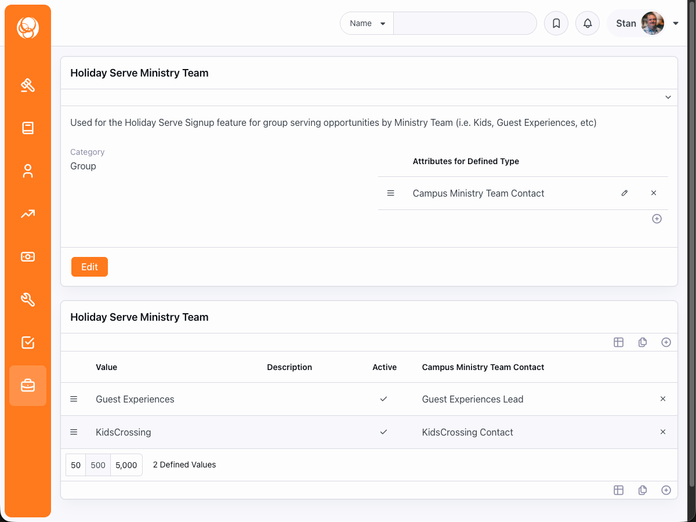

**Campus Ministry Team Contact attribute**

The signup workflow uses this attribute to look up who to notify when someone signs up for a role. Add a **Group Role** attribute to this Defined Type with the key `CampusMinistryTeamContact`, scoped to the **Campus Team** group type. Then set the value on each Defined Value to the Campus Team role responsible for that ministry at each campus.

This relies on Rock's built-in Campus Team feature — see the [Rock documentation on Campus Teams](https://community.rockrms.com/documentation/core-concepts/rock-fundamentals/campuses/handle-campus-teams) for how to set up Campus Teams and add members. The one additional step is adding a role to the Campus Team group type for each ministry you want to support (e.g., "KidsCrossing Contact," "Guest Experiences Lead").

> **Alternative:** If your church doesn't use Campus Teams, you can replace the `CampusMinistryTeamContact` Group Role attribute with a simpler **Person** or **Group** attribute on the Defined Value, then update the workflow to read from that attribute instead. The `scheduling@yourchurch.com` placeholder in the workflow serves as a fallback if no contact is found.

You'll need the **Id** of this Defined Type and the **Id** of each Defined Value for your Configuration Rigging.

### Step 2: Set Up the Group Type

Create a new Group Type with the following configuration:

**General:**
- Name: something like "Holiday Serving" (your choice)
- Purpose: Serving Area
- Location Selection Modes: Named
- Multiple Locations: Yes
- Enable Location Schedules: Yes

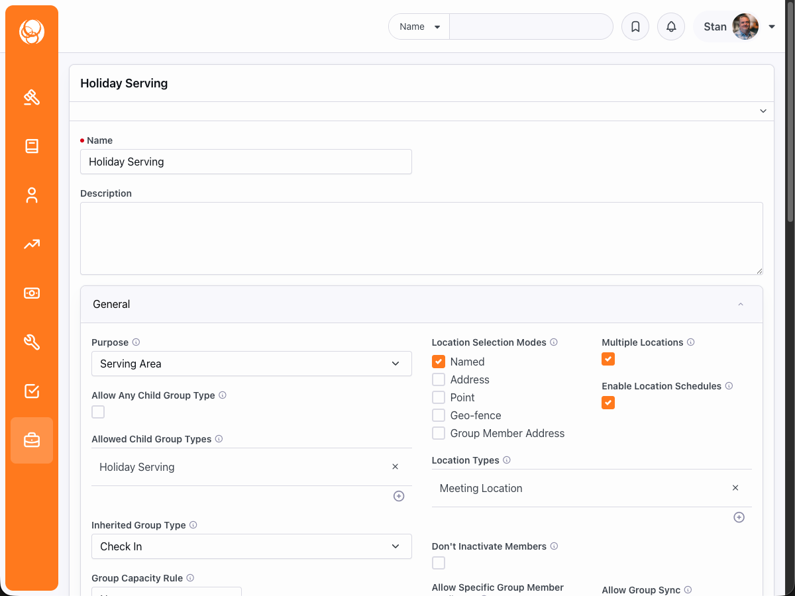

Under the **Scheduling** section, enable Group Scheduling:

- Scheduling Enabled: **Yes**

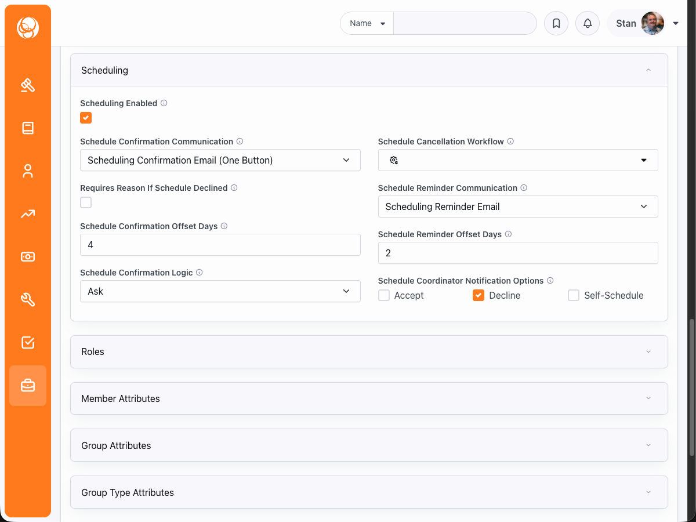

**Group Attributes** (add these to the Group Type):

| Key | Label | Field Type | Notes |
|---|---|---|---|
| `PublicLabel` | Public Label | Text | The name shown to volunteers on the signup page |
| `Icon` | Icon CSS Class | Text | Tabler icon class (e.g., `ti ti-hands`) |
| `SignUpAccessGroup` | Sign Up Access Group | Group | Optional — restricts signup to members of a specific group (see note below) |
| `HolidayServeMinistryTeam` | Holiday Serve Ministry Team | Defined Value | Use the Defined Type you created in Step 1 |

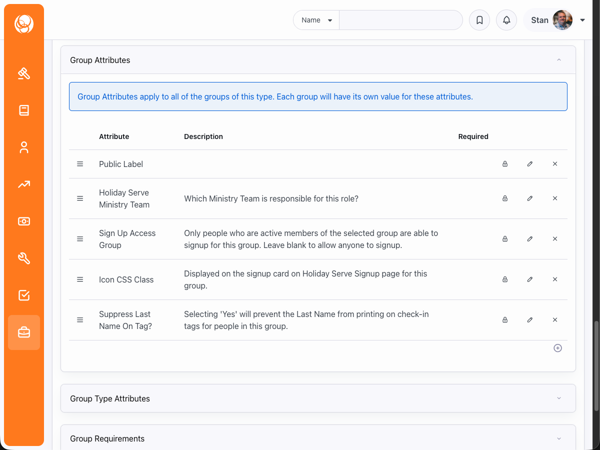

> **Why Sign Up Access Group?** This was one of the key reasons we built this solution. Ministry teams can share a single signup URL with their entire team — both existing volunteers and new folks — without needing to manage separate pages or instructions. Roles that require experience (e.g., a team lead position) are set up with a Sign Up Access Group pointing to an existing volunteer group. Those role cards only appear for members of that group. New volunteers see the open roles; experienced volunteers see everything they're eligible for. One link, one set of instructions, no confusion.

**Group Member Attributes** (add these to the Group Type):

| Key | Label | Field Type | Notes |
|---|---|---|---|
| `NewVolunteer` | New Volunteer? | Boolean | Track first-time volunteers |
| `Assistant` | Assistant? | Boolean | Flag volunteer team leads/assistants |

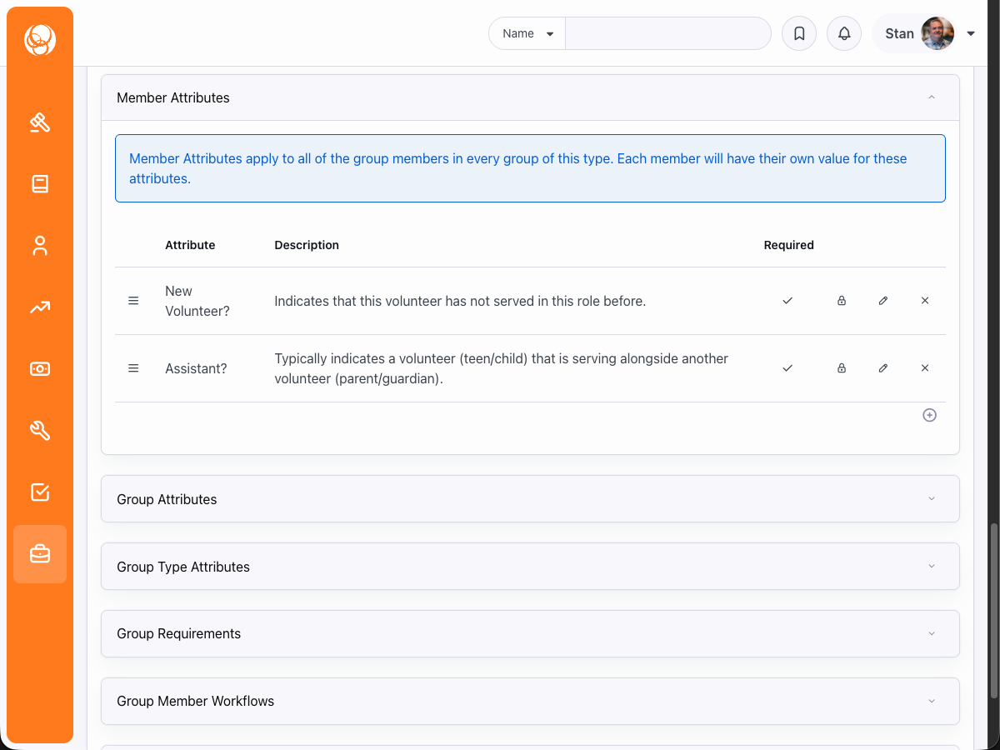

You'll need the **Id** of this Group Type for your Configuration Rigging.

### Step 3: Create Your Groups

For each serving role at each campus, create a group:

1. Set the **Group Type** to your Holiday Serving group type
2. Set the **Campus**
3. Set the **Public Label** attribute (what volunteers will see)
4. Set the **Icon** attribute (Tabler icon class, e.g. `ti ti-hands`)
5. Set the **Holiday Serve Ministry Team** attribute
6. Optionally set the **Sign Up Access Group** attribute if this role has restricted access
7. Set **Is Public = Yes** and **Is Active = Yes**

Under **Group Scheduling**, add Group Locations and link your service time Schedules. For each Group Location + Schedule, set the **Desired Capacity**.

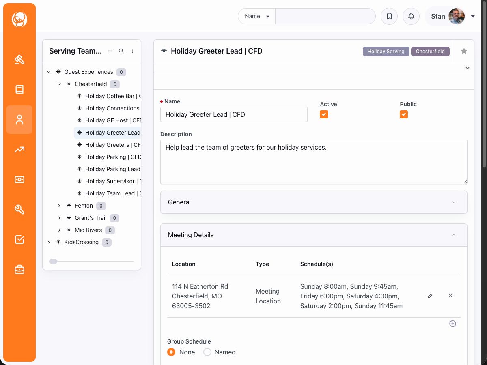

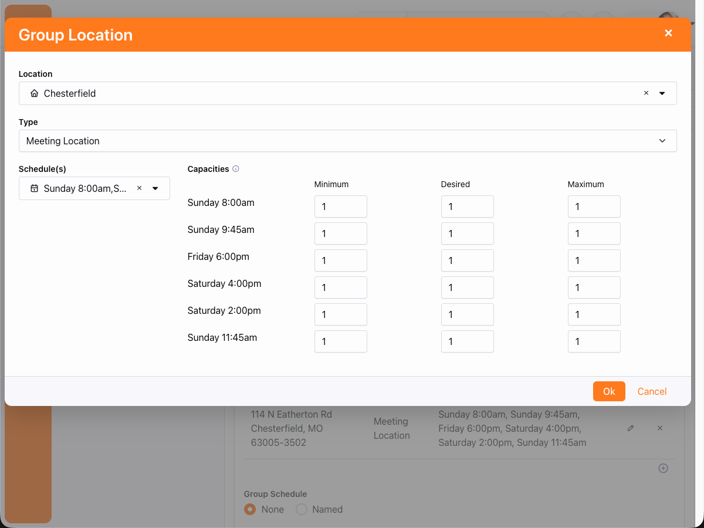

The group attributes filled in for a configured group will look something like this:

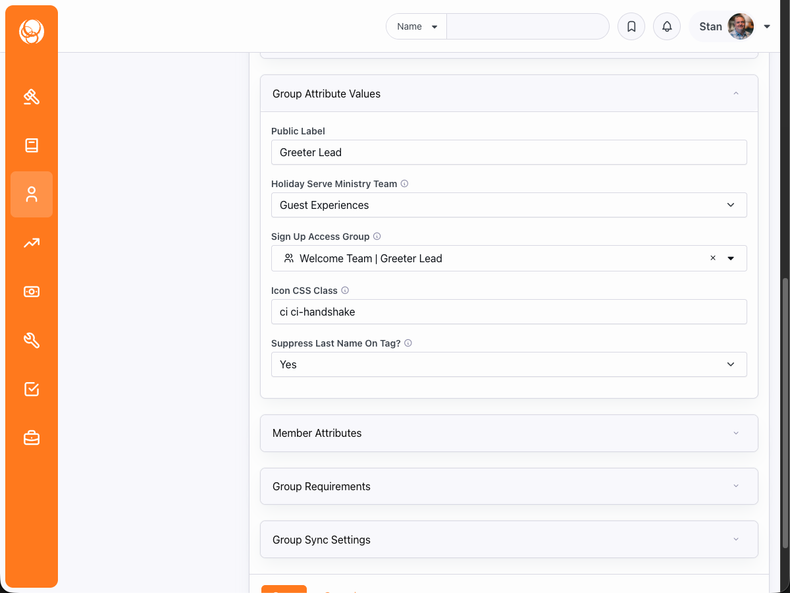

### Step 4: Create the Signup Workflow

When a volunteer clicks "Sign Me Up," they are redirected to a workflow entry page at a URL like:

```
/servechristmas/signup?Person={personAliasGuid}&Group={groupGuid}&Location={locationGuid}&Schedules={scheduleGuids}
```

This workflow receives those parameters and handles adding the person to the appropriate Attendance Occurrences with `ScheduledToAttend = true`. It also sends a confirmation email to the volunteer and a notification to the appropriate ministry team contact.

A Rock workflow export is included in the repo as `holiday-serve-signup-workflow.json`. You can import this in Rock under **Admin Tools > Settings > Power Tools > Workflow Import/Export**. Before using it, update the following placeholder email addresses to match your environment:

- `rock@yourchurch.com` — the "from" address on outgoing emails
- `scheduling@yourchurch.com` — fallback "to" address used when no ministry team contact is found
- `webhelp@yourchurch.com` — internal error notification address

You'll need the **WorkflowTypeId** for your Configuration Rigging.

### Step 5: Create the Helix Application

In Rock, go to CMS > Lava Applications and create a new application:

- **Name:** Holiday Serve Signup
- **Slug:** `holiday-serve-signup`
- **Status:** Active

Leave Configuration Rigging empty for now — you'll come back to it after you have all your IDs.

### Step 6: Create the Lava Endpoints

Create the following endpoints in your Helix application. The slug, HTTP method, and security mode for each are listed below. Paste the corresponding Lava code from the GitHub repo into each endpoint.

**Public-facing endpoints (Security Mode: Application View):**

| Name | Slug | Method |
|---|---|---|
| Get Serve Roles | `get-serve-roles` | PUT |
| Get Role Locations | `get-role-locations` | GET |
| Get Location Services | `get-location-services` | GET |
| Get Signup Button | `get-signup-button` | PUT |

**Staff admin endpoints (Security Mode: Application Edit):**

| Name | Slug | Method |
|---|---|---|
| Admin Get Groups | `admin-get-groups` | PUT |
| Admin Get Group | `admin-get-group` | GET |
| Admin Get Group Member | `admin-get-group-member` | GET |
| Get Status Addl Options | `get-status-addl-options` | PUT |
| Get Status Board | `get-status-board` | PUT |
| Get Status Location Schedule | `get-status-location-schedule` | GET |

**Write endpoints (Security Mode: Endpoint Execute):**

| Name | Slug | Method |
|---|---|---|
| Admin Edit Group Member | `admin-edit-group-member` | GET |
| Admin Save Group Member | `admin-save-group-member` | PUT |

### Step 7: Configure the Configuration Rigging

In your Helix application, open Configuration Rigging and enter the following JSON, substituting your own IDs:

```json
{
    "HolidayServingGroupTypeId": [YOUR GROUP TYPE ID],
    "RockAdminSecurityGroupId": [YOUR ROCK ADMIN SECURITY GROUP ID],
    "SignUpWorkflowTypeId": [YOUR SIGNUP WORKFLOW TYPE ID],
    "HolidayServeMinistryTeamDefinedTypeId": [YOUR MINISTRY TEAM DEFINED TYPE ID],
    "MinistryTeamKidsDefinedValueId": [YOUR KIDS MINISTRY DEFINED VALUE ID],
    "MinistryTeamGuestExperiencesDefinedValueId": [YOUR GUEST EXPERIENCES DEFINED VALUE ID],
    "BackgroundCheckWorkflowTypeId": [YOUR BACKGROUND CHECK WORKFLOW TYPE ID],
    "BackgroundCheckBadgeId": [YOUR BACKGROUND CHECK BADGE ID],
    "GroupMemberNoteTypeId": [YOUR GROUP MEMBER NOTE TYPE ID],
    "CampusStatusValueIdOpen": [YOUR "OPEN" CAMPUS STATUS DEFINED VALUE ID],
    "CampusTypeValueIdPhysical": [YOUR "PHYSICAL" CAMPUS TYPE DEFINED VALUE ID],
    "LocationTypeCampusValueId": [YOUR "CAMPUS" LOCATION TYPE DEFINED VALUE ID],
    "GroupAdminPagePath": "[PATH TO YOUR GROUP DETAIL ADMIN PAGE]",

    "AttributeIds": {
        "PublicLabelAttrId": [ATTRIBUTE ID FOR PublicLabel],
        "SignUpAccessGroupAttrId": [ATTRIBUTE ID FOR SignUpAccessGroup],
        "IconAttrId": [ATTRIBUTE ID FOR Icon],
        "MinistryTeamAttrId": [ATTRIBUTE ID FOR HolidayServeMinistryTeam]
    }
}
```

> **Tip:** You can find Attribute IDs in Rock under Admin Tools > General Settings > Attributes, filtering by Entity Type "Group."

### Step 8: Deploy the Print Stylesheet

Copy `HolidayServeStatusBoardPrint.css` from the repo into your Rock theme folder. The status board's print function references it at:

```
/Themes/[YourTheme]/XingAssets/HolidayServe/HolidayServeStatusBoardPrint.css
```

Update the path in `scripts/holidayservestatusboard-scripts.lava` to match your theme name and preferred folder structure.

### Step 9: Set Up the Pages

You'll need three pages. Each page requires a **Lava Application Content** block (pointing to your Helix app) plus one or two **HTML Content** blocks for page-specific styles and scripts.

**Page 1: Public Signup**
- Route: `/servechristmas` and/or `/serveeaster` (the block detects the URL path to set the holiday context)
- Lava Application Content block: paste from `lava-application/content-blocks/HolidaySignup.lava`
- HTML Content block (styles): paste from `styles/holidayserve-styles.lava`
- HTML Content block (intro): paste from `holidayserve-introparagraph.lava` — **this is example content with Crossing-specific copy.** Replace the intro text, event dates, and ministry name references with your own.
- HTML Content block (scripts, optional): if any of your endpoints return tooltip-enabled content, add a block with the `htmx:afterSettle` tooltip initializer:
```html
<script>
    document.body.addEventListener('htmx:afterSettle', function(evt) {
        $(evt.detail.elt).find('[data-toggle="tooltip"]').tooltip();
    });
</script>
```
- Security: open to all (unauthenticated users can view the page; the family member dropdown is hidden when no one is logged in)

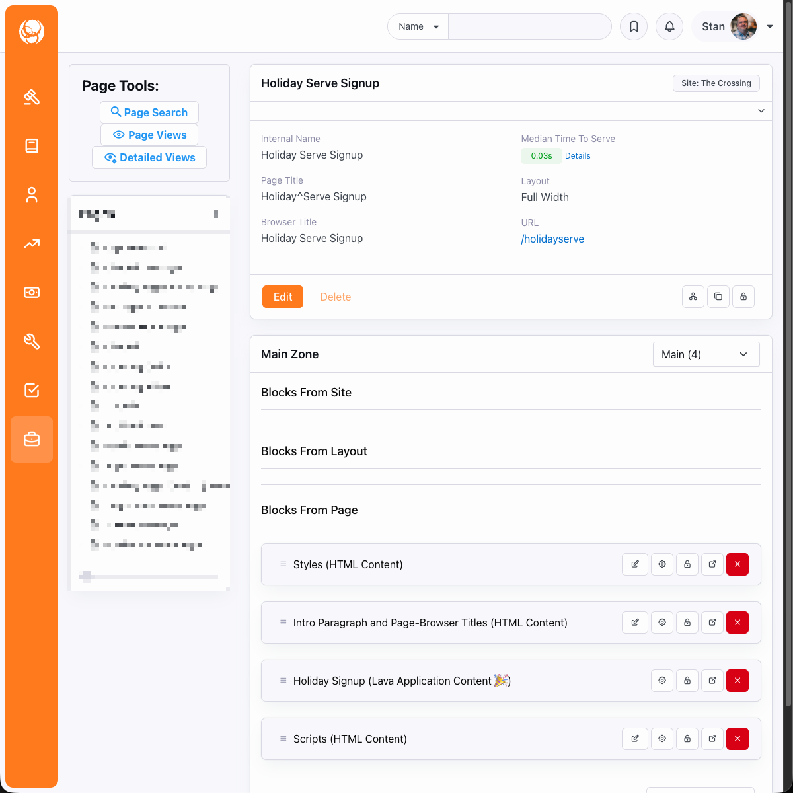

**Page 2: Staff Admin**
- Route: your choice (e.g., `/holidayservecentral/admin`)
- Lava Application Content block: paste from `lava-application/content-blocks/HolidayServeAdmin.lava`
- HTML Content block (styles): paste from `styles/holidayserveadmin-styles.lava`
- HTML Content block (scripts): paste from `scripts/holidayserveadmin-scripts.lava` — contains the toast notification functions (`showToast` / `debounceToast`) used by the save endpoint
- Security: restrict to ministry team staff (Application Edit security on the Helix app controls what they can see)

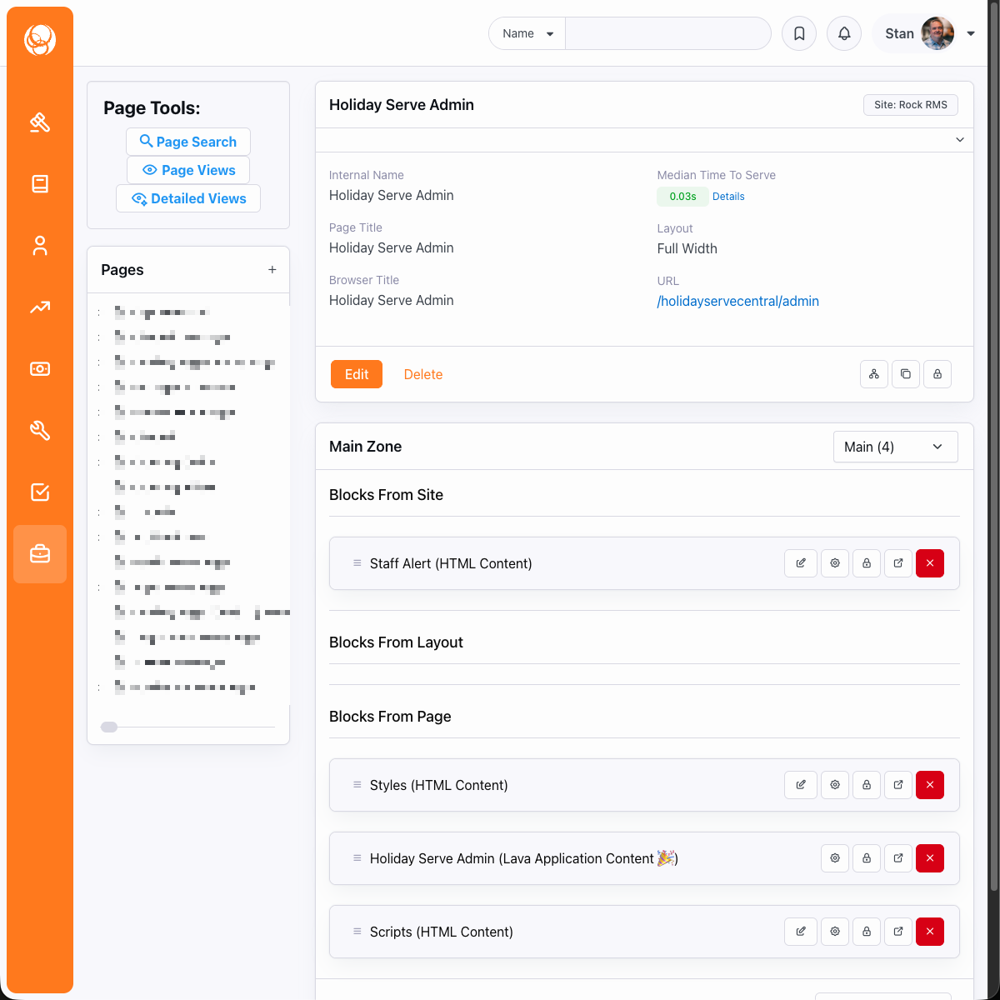

**Page 3: Status Board**
- Route: your choice (e.g., `/holidayservecentral/statusboard`)
- Lava Application Content block: paste from `lava-application/content-blocks/HolidayServeStatusBoard.lava`
- HTML Content block (styles): paste from `styles/holidayservestatusboard-styles.lava`
- HTML Content block (scripts): paste from `scripts/holidayservestatusboard-scripts.lava` — contains the `printStatusBoard()` function
- Security: restrict to ministry team staff

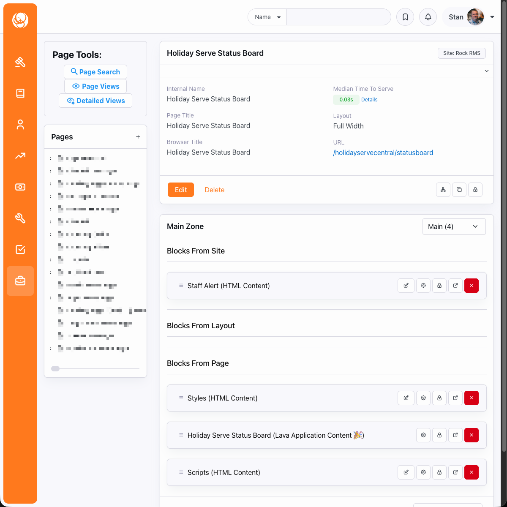

**Page 4: Workflow Entry (Signup Confirmation)**
- Route: must match the path your signup button constructs (e.g., `/holidayserve/signup`)
- Add a standard Rock **Workflow Entry** block configured to launch your signup workflow. Set the block's CSS Class to `xingform` — this scopes the workflow entry styling so it doesn't affect other elements on the page. You can use a different class name, but you'll need to update the CSS in `styles/holidayservewf-styles.lava` to match.
- HTML Content block (styles + page title): paste from `styles/holidayservewf-styles.lava` — this block also sets the browser and page title based on the URL path (Christmas vs Easter), so it needs to be present even if you don't customize the styles

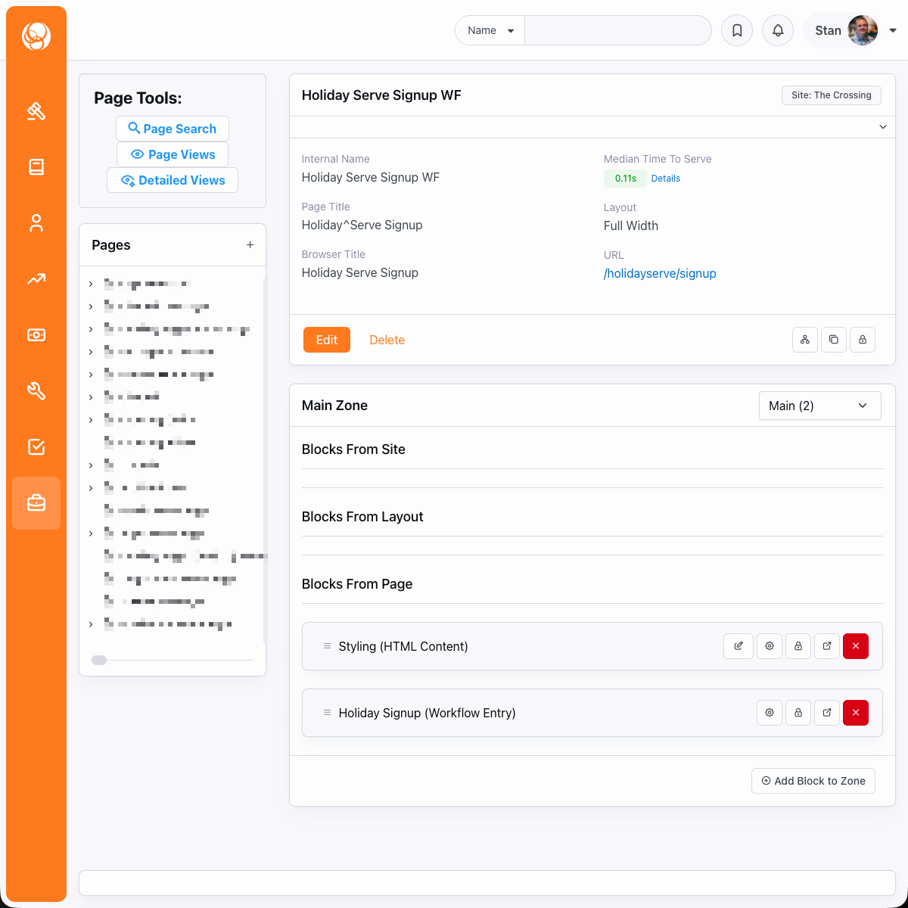

**Group Management Page**
The admin UI includes a link to edit total slots for a group. Set `GroupAdminPagePath` in Configuration Rigging to the path of your Rock Group Detail admin page (e.g., `/rock/group/{0}`).

### Optional Enhancement: Holiday Serve Central Hub Page

We created a parent hub page at `/holidayservecentral` that lives under `/people/manage` (so it appears in Rock's internal left nav) and acts as a launch pad for all Holiday Serve admin pages. It uses a single **Page Menu** block configured with your Holiday Serve Central page as the Root Page and Rock's built-in `PageListAsBlocks.lava` as the template:

```

```

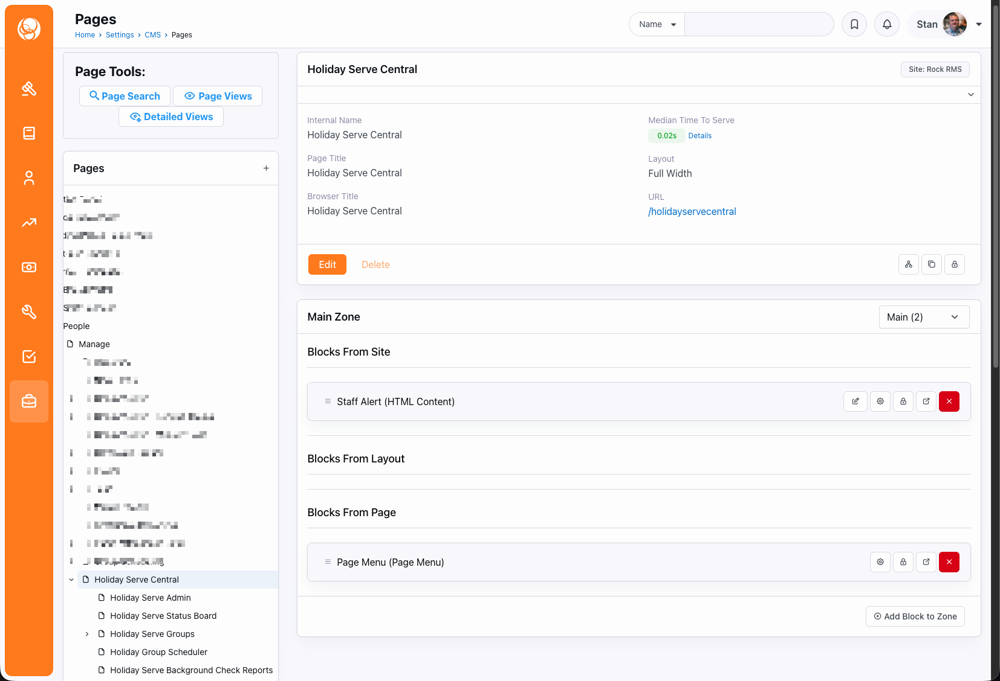

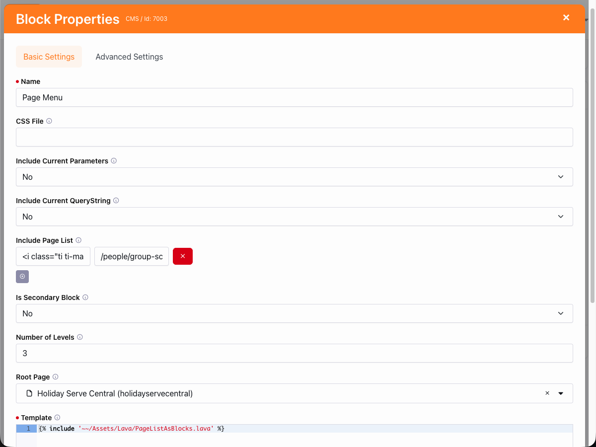

Child pages hang off this parent, so staff get one place to access everything. Here's what we put under it:

- **Holiday Serve Admin** — the Helix admin page (Step 9, Page 2)
- **Holiday Serve Status Board** — the Helix status board page (Step 9, Page 3)
- **Holiday Serve Groups** — a standard Rock Group Detail page scoped to your Holiday Serving Group Type, so staff can manage locations, schedules, and slot capacities without landing in Rock's main group admin. Set `GroupAdminPagePath` in Configuration Rigging to this page's route.
- **Holiday Group Scheduler** — a standard Rock Group Scheduler page filtered to your Holiday Serving Group Type. Useful for sending scheduling confirmations and managing RSVPs.
- **Holiday Serve Background Check Reports** — data views or reports per campus listing volunteers who need a background check. Saves staff from having to check each group individually.
- **Group Schedule Communication** — a link to Rock's standard Group Schedule Communication page. Rather than adding it as a child page, add it via the **Include Page List** setting on the Page Menu block. This surfaces it in the hub without it needing to live in your page tree under Holiday Serve Central. The tradeoff: breadcrumbs won't show Holiday Serve Central as a parent when staff navigate to that page.

Not required, but it makes the experience much cleaner for ministry teams.

---

## How It Works: The Public Signup Flow

The signup experience is a step-by-step progressive disclosure — each selection loads the next step via HTMX without a full page reload.

1. **Campus selection (+ family member if logged in)** — The block loads with a radio button list of active physical campuses. If the user is logged in, a family member dropdown also appears (defaults to the logged-in person) allowing them to sign up on behalf of a family member. Any change to either field triggers a PUT to `get-serve-roles`.

2. **Role selection** (`get-serve-roles`) — Queries all groups in your Group Type for the selected campus. For each group, it calculates SlotsDesired, SlotsFilled, and SlotsNeeded using three CTEs against GroupLocationScheduleConfig and Attendance. Renders role cards sorted by availability (open roles first). If a role has a SignUpAccessGroup, the card is only shown to members of that group (or Rock admins).

3. **Location selection** (`get-role-locations`) — Clicked from a role card. Runs the same slot calculation at the location level. If only one location exists, it skips the selection step and auto-loads services.

4. **Service time selection** (`get-location-services`) — Shows checkboxes for each service time with slot availability. Selecting one or more services triggers `get-signup-button`.

5. **Signup button** (`get-signup-button`) — Appears when at least one service is selected. Renders a link to the signup workflow with Person, Group, Location, and Schedules as query parameters. Button label personalizes based on who is signing up ("Sign Me Up" vs. "Sign Up [Name]").

---

## How It Works: The Staff Admin

Ministry staff (not Rock admins — anyone with Application Edit access to the Helix app) can manage their groups from a single page.

1. **Ministry + campus filter** — Staff select their ministry team and campus. User preferences are saved so their selection persists between sessions.

2. **Group cards** (`admin-get-groups`) — Shows all groups for the selected ministry/campus with a quick slot summary (have / need) per location. A pending volunteer badge shows if any members need review.

3. **Group detail** (`admin-get-group`) — Clicking a group card loads a full slot grid (locations × service times) showing total/filled/open slots, plus a volunteer table. Each volunteer row lazy-loads its own data.

4. **Volunteer row** (`admin-get-group-member`) — Shows name, status, date added, scheduled services with RSVP status, background check status (for Kids ministry), and New/Assistant flags. Rows can be triggered to reload via HTMX events after an edit.

5. **Edit volunteer** (`admin-edit-group-member` + `admin-save-group-member`) — A modal lets staff update status (Active/Pending/Inactive), New Volunteer flag, and Assistant flag. On save, the volunteer row reloads automatically. A toast notification confirms success.

---

## How It Works: The Status Board

The status board is a real-time view of volunteer coverage, designed to be used by ministry leads during the busy signup period — and printable for day-of use.

Staff select a ministry, campus, and optionally filter by specific groups and service times. The board renders as a table: groups/locations as rows, service times as columns. Each cell lazy-loads volunteer names for that slot, with visual indicators for new volunteers and assistants.

Loading is staggered (each row loads with an incrementally longer delay) to avoid hammering the server when the board first loads.

---

## Customization Guide

### Use it for any one-off volunteer campaign, not just holidays

The "holiday" framing is specific to our context, but the architecture works for any short-term campaign. Rename the Defined Type values, swap the URL paths, and update the holiday switch logic in `HolidaySignup.lava`.

### Add or remove ministry teams

Add or deactivate Defined Values in your Ministry Team Defined Type. The dropdowns and filters throughout the app pull from this list dynamically.

### Remove the multi-holiday support

If you're only running one campaign at a time, remove the `holidaySwitch` logic from `HolidaySignup.lava` and hardcode the `wfPath` in `get-signup-button.lava`.

### Remove the background check column

If you don't need to display background check status for any ministry, remove the `showBkgdCheck` logic from `admin-get-group.lava` and `admin-get-group-member.lava`, and remove the related rigging values.

### Remove the access-restricted roles

If all your serving roles are open to everyone, you can simplify `get-serve-roles.lava` by removing the `SignUpAccessGroupGuid` check entirely. You can also remove the `SignUpAccessGroup` attribute from your Group Type.

### Swap the brand color

All four style files define the same custom property at the top:

```css
:root {
    --secondary-color-lifeblood: #a1302b;
}
```

Replace `#a1302b` with your own brand color in all four files in the `styles/` folder. This controls panel headers, selected card states, the signup button, and the submit button on the workflow entry page.

### Adjust the slot calculation

The SlotsDesired / SlotsFilled / SlotsNeeded CTE pattern appears in several endpoints. If you want to show or hide roles/locations based on different thresholds, this is where to make that change.

### Support more than two service types (New Volunteer / Assistant)

Group Member attributes are easy to extend. Add a new boolean attribute to your Group Type, add it to the edit form in `admin-edit-group-member.lava`, save it in `admin-save-group-member.lava`, and display it in `admin-get-group-member.lava` and `get-status-location-schedule.lava`.

---

## Questions?

Drop a comment on the [Rock Community post](https://community.rockrms.com/recipes), open an issue in this repo, or find us on RocketChat — we're **@stan.yoder** and **@karenrossi**. If you build something from this, we'd love to hear how you adapted it.

*— Stan & Karen, The Crossing*

*Presented at RX2026. The Crossing is a four-campus church near St. Louis, MO.*
